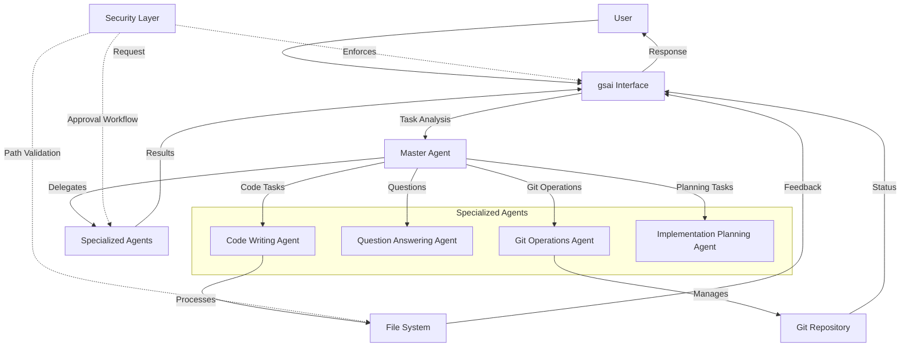

Hello

# GitStart CoPilot

**Made by GitStart AI** 🤖

## Welcome! 👋

Welcome to GitStart CoPilot! We're excited to have you here. This powerful tool is designed to be your intelligent coding companion, helping you write better code, explore complex codebases, and streamline your development workflow. Whether you're a seasoned developer or just starting your coding journey, this AI assistant is here to support you every step of the way.

Ready to supercharge your coding experience? Let's get started! 🚀

---

🤖 **Interactive AI Coding Assistant** - Your AI pair programming partner

An interactive command-line interface that provides an AI coding assistant with specialized capabilities for code writing, codebase exploration, git operations, and implementation planning.

## Features

### 🚀 Interactive Chat Interface
- Rich terminal UI with syntax highlighting
- Real-time AI assistance for coding tasks
- Session-based conversations with context retention

### 🔧 Specialized AI Capabilities
- **Code Writing & Editing**: Intelligent code modifications with precise targeting
- **Codebase Q&A**: Natural language queries about your codebase
- **Git Operations**: Automated git workflows with commit management
- **Implementation Planning**: Break down complex tasks into actionable steps

### 🔒 Security & Approval System
- **Directory Limitation**: Operations restricted to working directory
- **Configurable Approval Modes**:
  - `suggest`: Requires approval for all changes (read-only by default)
  - `auto-edit`: Can edit files, requires approval for commands
  - `full-auto`: Can edit files and run commands without approval
- **Path Validation**: All file operations validated for security

### 🛠️ Development Tools
- **Code Search**: Advanced pattern matching with AST context
- **File Navigation**: Quick file structure overview and content viewing
- **Syntax Linting**: Built-in code validation using Tree-sitter
- **Git Integration**: Automatic commit creation for file modifications

## Installation

### 🚀 Quick Installation (Recommended)

**Download Pre-built Executables:**
- **Linux/macOS**: No Python required - just download and run!
- **Windows**: Self-contained `.exe` file

```bash
# Linux/macOS one-liner
curl -L -o gsai https://github.com/your-org/gitstart-cli/releases/latest/download/gsai-$(uname -s | tr '[:upper:]' '[:lower:]')-x86_64
chmod +x gsai && sudo mv gsai /usr/local/bin/

# Verify installation
gsai --version
```

**From Releases Page:**
1. Go to [Releases](../../releases)
2. Download for your platform:
   - `gsai-linux-x86_64` (Linux)
   - `gsai-macos-x86_64` (macOS)  
   - `gsai-windows-x86_64.exe` (Windows)
3. Make executable and add to PATH

### 📖 Platform-Specific Installation Guides

For detailed installation instructions:

- **[Linux Installation Guide](docs/installation-linux.md)** - Ubuntu, Debian, CentOS, Arch, etc.
- **[macOS Installation Guide](docs/installation-macos.md)** - Homebrew, manual installation, Apple Silicon
- **[Windows Installation Guide](docs/installation-windows.md)** - PowerShell, package managers, troubleshooting

### 🛠️ Install from Source

**Prerequisites:** Python 3.12+, Git

```bash
# Clone repository
git clone https://github.com/your-org/gitstart-cli.git
cd gitstart-cli

# Install with uv (recommended)
curl -LsSf https://astral.sh/uv/install.sh | sh
uv sync && uv tool install .

# Or with pip
pip install -e .
```

### 📦 Package Managers

```bash
# Homebrew (macOS/Linux)
brew install gitstart/cli/gsai

# More package managers in platform guides
```

## 📚 Documentation

### 🎯 Quick Links

- **[📖 Complete Documentation](docs/README.md)** - Full documentation index
- **[⚡ Quick Start Guide](docs/quick-start.md)** - Get up and running in 5 minutes
- **[⚙️ Configuration Guide](docs/configuration.md)** - API keys, settings, and customization
- **[🛠️ CLI Reference](docs/cli-reference.md)** - Complete command reference
- **[❓ FAQ](docs/faq.md)** - Frequently asked questions
- **[🚨 Troubleshooting](docs/troubleshooting.md)** - Common issues and solutions

### 🚀 Getting Started

**New to GitStart CoPilot CLI?** Start here:

1. **[Install](docs/installation.md)** for your platform (Linux/macOS/Windows)
2. **[Quick Start](docs/quick-start.md)** - 5-minute setup guide
3. **[Configuration](docs/configuration.md)** - Set up API keys and preferences
4. **[Examples](docs/examples.md)** - See it in action

### 📖 Full Documentation

Visit the **[docs/](docs/)** directory for complete guides:

**Getting Started:**
- [Installation Guide](docs/installation.md) - All installation methods
- [Quick Start](docs/quick-start.md) - Get running in 5 minutes  
- [Configuration](docs/configuration.md) - API keys and settings

**Platform Guides:**
- [Linux Installation](docs/installation-linux.md) - Ubuntu, Debian, CentOS, Arch
- [macOS Installation](docs/installation-macos.md) - Homebrew, Apple Silicon
- [Windows Installation](docs/installation-windows.md) - PowerShell, package managers

**Usage & Reference:**
- [Basic Usage](docs/usage.md) - Essential commands and workflows
- [CLI Reference](docs/cli-reference.md) - Complete command reference
- [Advanced Features](docs/advanced-features.md) - Power user features
- [Examples](docs/examples.md) - Real-world usage examples

**Help & Support:**
- [FAQ](docs/faq.md) - Frequently asked questions
- [Troubleshooting](docs/troubleshooting.md) - Common issues and solutions

## ⚡ Quick Start

### 1. Install and Configure

```bash
# Download and install (Linux/macOS)
curl -L -o gsai https://github.com/your-org/gitstart-cli/releases/latest/download/gsai-$(uname -s | tr '[:upper:]' '[:lower:]')-x86_64
chmod +x gsai && sudo mv gsai /usr/local/bin/

# Configure API keys
gsai configure
```

### 2. Start Coding with AI

```bash
# Navigate to your project
cd your-project

# Start AI coding session
gsai chat
```

**That's it!** You're now ready to code with AI assistance.

### 3. Try These Commands

```bash
You: What does this project do? Give me an overview.
You: Add error handling to the login function in auth.py
You: Create a Python function to validate email addresses
You: Review my recent changes and suggest improvements
```

## 📋 Initial Setup Details

After installation, gsai uses a global configuration system that stores your settings in `~/.ai/gsai/.env`. This means you only need to configure your API keys once, and they'll work across all your projects.

```bash
# Configure your API keys and preferences
gsai configure
```

This interactive setup will guide you through:
- **API Keys**: Set up OpenAI and/or Anthropic API keys (at least one required)
- **Approval Mode**: Choose your security preference (see below)
- **Web Search**: Enable/disable web search capabilities
- **Model Preferences**: Select which AI models to use

### 2. Understanding Approval Modes

Choose the approval mode that fits your workflow:

- **`suggest`** (Recommended for beginners): Read-only mode that shows you what changes would be made and asks for approval
- **`auto-edit`**: Automatically edits files but asks permission before running commands
- **`full-auto`**: Makes changes and runs commands without approval (use with caution)

You can change this anytime with `gsai configure` or using slash commands during chat.

### 3. Start Your First Coding Session

Navigate to your project directory and start a chat session:

```bash
# Navigate to your project
cd /path/to/your/project

# Start gsai in the current directory
gsai chat

# Or specify a different directory
gsai chat --directory /path/to/another/project
```

### 4. In-Session Commands

Once in a chat session, you have access to powerful slash commands:

```
/help              # Show all available slash commands
/config or /status # Check your current configuration
/set-api-key       # Update API keys without leaving the session
/migrate-config    # Migrate local .env to global configuration
```

### 5. Your First AI Interactions

Here are some great ways to get started:

**Explore your codebase:**
```
💬 You: What does this project do? Can you give me an overview of the codebase structure?

🤖 AI: I'll analyze your project structure and give you a comprehensive overview...
```

**Get help with specific code:**
```
💬 You: I have a function in src/utils.py that's running slowly. Can you help optimize it?

🤖 AI: I'll examine the function in src/utils.py and suggest optimizations...
```

**Implement new features:**
```
💬 You: I need to add user authentication to my Flask app. Can you help me implement it?

🤖 AI: I'll help you implement user authentication. Let me first understand your current Flask setup...
```

**Debug issues:**
```
💬 You: I'm getting a "TypeError: 'NoneType' object is not subscriptable" error. Can you help me find and fix it?

🤖 AI: I'll help you debug this TypeError. Let me search for potential causes in your code...
```

### 6. Check Your Setup

Verify everything is working correctly:

```bash
# Check your configuration and API key status
gsai status

# View version information
gsai version
```

### 7. Pro Tips for New Users

- **Start with `suggest` mode**: This lets you see what gsai would do before it makes changes
- **Use specific requests**: Instead of "fix my code," try "optimize the database query in models.py"
- **Leverage codebase exploration**: Ask gsai to explain unfamiliar code before making changes
- **Take advantage of git integration**: gsai can create meaningful commit messages for your changes

## Commands

### `gsai chat`
Start an interactive AI coding session
- `--directory, -d`: Specify working directory (defaults to current)

### `gsai configure`
Set up API keys and preferences
- Interactive prompts for all configuration options
- Creates `.env` file in current directory

### `gsai status`
Show current configuration and status
- API key status
- Current settings
- Working directory and git information
- Usage limits

### `gsai version`
Display version information

## Configuration

### Environment Variables

Create a `.env` file in your project directory or set environment variables:

```bash
# API Keys (at least one required)
OPENAI_API_KEY=your_openai_api_key
ANTHROPIC_API_KEY=your_anthropic_api_key

# Security Settings
APPROVAL_MODE=suggest  # suggest, auto-edit, or full-auto
WEB_SEARCH_ENABLED=false

# Model Configuration
MASTER_AGENT_MODEL_NAME=anthropic:claude-3-7-sonnet-latest
CODING_AGENT_MODEL_NAME=anthropic:claude-3-7-sonnet-latest
QA_AGENT_MODEL_NAME=anthropic:claude-3-7-sonnet-latest

# Usage Limits
MAX_TOKENS_PER_SESSION=100000
MAX_REQUESTS_PER_SESSION=50

# Logging
LOG_LEVEL=INFO
```

### Approval Modes

- **`suggest`** (Default): Read-only mode, requires approval for all file changes and commands
- **`auto-edit`**: Can edit files automatically, requires approval for command execution
- **`full-auto`**: Can edit files and run commands without approval (use with caution)

## Usage Examples

### Code Writing
```
💬 You: Create a new Python class for handling user authentication

🤖 AI: I'll create a user authentication class for you. Let me first check your project structure...
```

### Codebase Exploration
```
💬 You: How does the database connection work in this project?

🤖 AI: Let me analyze your database connection implementation...
```

### Git Operations
```
💬 You: Commit my changes with a descriptive message

🤖 AI: I'll review your changes and create an appropriate commit message...
```

### Implementation Planning
```
💬 You: I need to add user roles and permissions to my app

🤖 AI: I'll help you plan the implementation of user roles and permissions. Let me break this down into steps...
```

## Architecture

### Agent System
- **Master Agent**: Orchestrates task delegation and provides unified interface
- **Specialized Agents**: Handle specific domains (coding, Q&A, git, planning)
- **Tool Integration**: Comprehensive set of development tools



### Security Model
- **Path Validation**: All operations validated against working directory
- **Approval Workflows**: User confirmation for sensitive operations
- **Usage Tracking**: Monitor token and request consumption

### Tool Ecosystem
- **File Operations**: Read, write, move, and modify files safely
- **Code Analysis**: Search, parse, and understand code structure
- **Development Tools**: Linting, git operations, and project navigation

## Development

### Project Structure
```
gitstart-copilot/
├── ai_coding_cli/
│   ├── agents/          # AI agent implementations
│   ├── tools/           # Development tools
│   ├── config.py        # Configuration management
│   ├── security.py      # Security and approval system
│   ├── models.py        # AI model configuration
│   ├── chat.py          # Interactive chat interface
│   └── main.py          # CLI application entry point
├── pyproject.toml       # Project configuration
└── README.md           # This file
```

### Development Commands

This project uses [uv](https://docs.astral.sh/uv/) for dependency management. After making any code changes, run these commands to ensure code quality before committing:

```bash
# Type checking
uv run mypy .

# Linting and formatting
uv run ruff format

# Run tests
uv run pytest
```

These commands should be run in sequence after any code modifications to maintain code quality and consistency.

### Contributing

1. Fork the repository
2. Create a feature branch
3. Make your changes
4. Run the development commands above to ensure code quality
5. Add tests if applicable
6. Submit a pull request

### Running Tests

```bash
# Run with uv
uv run pytest

# Or with pip
pytest
```

## Troubleshooting

### Common Issues

**"No API keys configured"**
- Run `gsai configure` to set up your API keys
- Ensure at least one of OPENAI_API_KEY or ANTHROPIC_API_KEY is set

**"Operation denied: Path outside working directory"**
- The CLI restricts operations to the working directory for security
- Use `--directory` to specify the correct working directory

**"Parser not available for language"**
- Some advanced features require tree-sitter language parsers
- Most common languages are supported out of the box

### Getting Help

- Use `gsai --help` for command information
- Check `gsai status` for configuration issues
- Review logs for detailed error information

## License

This project is licensed under the MIT License - see the LICENSE file for details.

## Acknowledgments

- Built with [Typer](https://typer.tiangolo.com/) for CLI framework
- Uses [pydantic-ai](https://ai.pydantic.dev/) for AI agent implementation
- Powered by [Rich](https://rich.readthedocs.io/) for beautiful terminal UI
- Code analysis with [Tree-sitter](https://tree-sitter.github.io/)